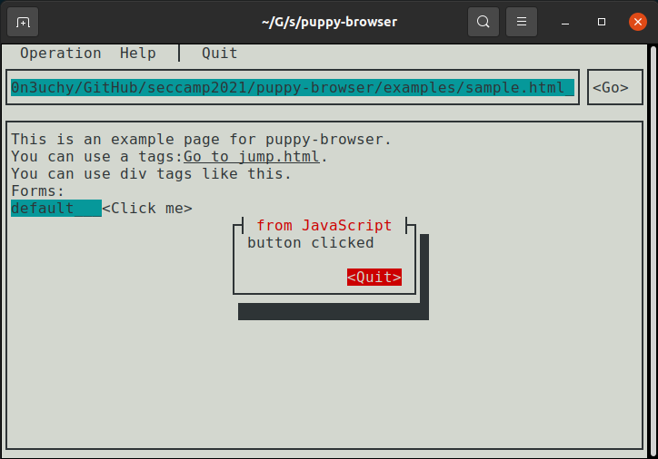

# puppy

[](https://github.com/lmt-swallow/puppy/actions/workflows/test.yml) [](https://github.com/lmt-swallow/puppy/actions/workflows/lint.yml)

`puppy` is an example implementation of a tiny Web browser for educational purposes.



## How to run puppy locally

You can run puppy program with the following command(s):

```sh
cargo run -- help
```

## How to install puppy

You can install puppy by the following command(s):

```sh
cargo install --locked --path . --force
```

After you have successfully installed puppy, you can see help as follows:

```sh
puppy help
```

You can install shell completions as follows:

```sh
# in bash
eval "$(puppy completion bash)"

# in fish
puppy completion fish | source
```

## How to run tests locally

You can run tests with the following command(s):

```sh
cargo test
```

## How to speed up build process

You can cache files related to V8 as follows:

```bash
$ export RUSTY_V8_MIRROR=$HOME/.cache/rusty_v8
(...omitted...)
$ ./scripts/prepare-v8.sh
(...omitted...)
$ cargo build
(...omitted...)
```
